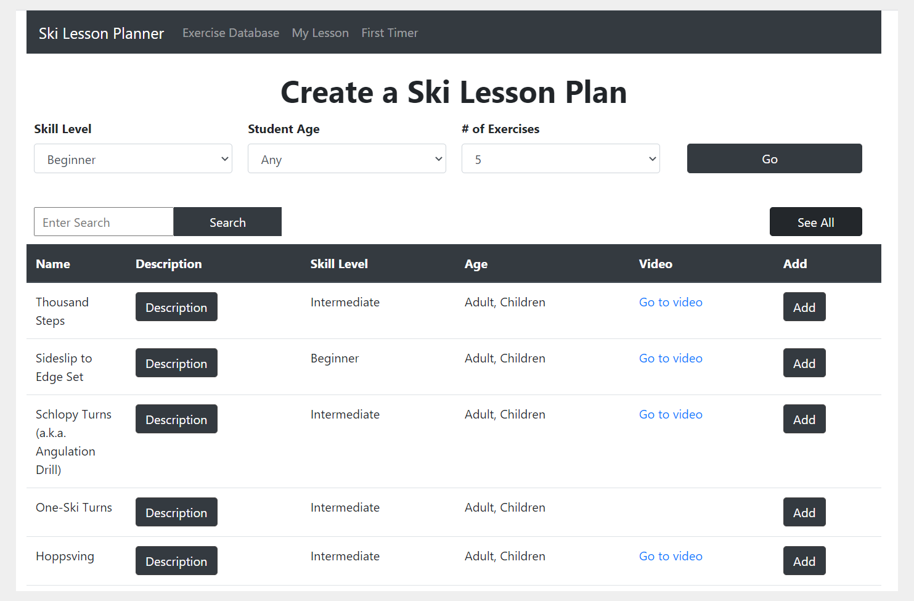

Ski Instructor Lesson Planner - Client Side
============

This is a React project, the client side of a MERN web application. 

---
## Buy me a coffee

Whether you use this project, have learned something from it, or just like it, please consider supporting it by buying me a coffee, so I can dedicate more time on open-source projects like this :)

---

## Features
- Search Ski Exercise Database
- Generate Sample Exercise Plan
- Generate PDF Lesson Plans
- Material Design
- Other awesome features yet to be implemented

---

## Setup
Clone this repo to your desktop and run `npm install` to install all the dependencies.

---

## Usage
Once the dependencies are installed, you can run  `npm start` to start the application. You will then be able to access it at localhost:3000

---

## License
>You can check out the full license [here](https://github.com/liannedls/ski_app_client/master/LICENSE)

This project is licensed under the terms of the **MIT** license.
